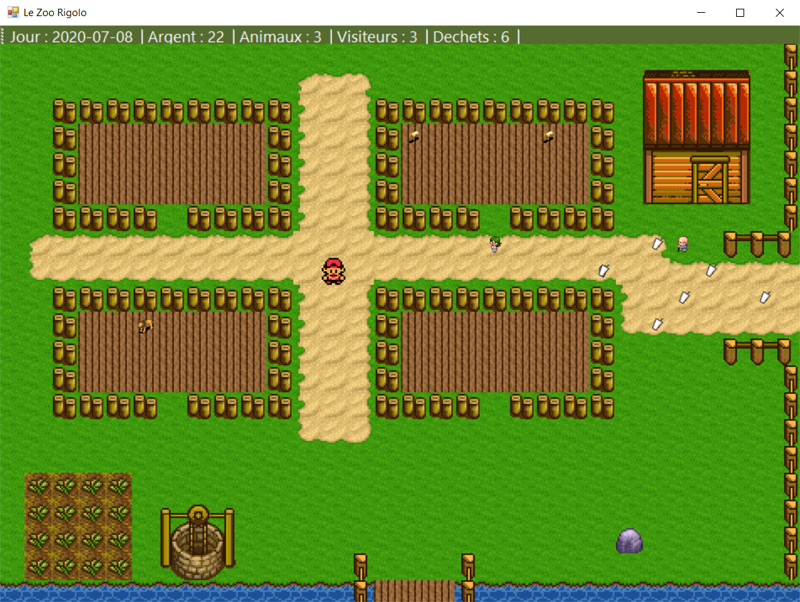

# Zoo_DevGraphique
 Travail pratique du cours de développement graphique
 
 

### Membres de l'équipe:
 - Clément Deffes
 - Jean-Philippe Tremblay
 - Vincent Nadeau
 - Patrick Jurewicz
 
## Fonctionnement

### Joueur

 Le Joueur peut : 
 - Ajouter des animaux dans les enclos
 - Nourrir les animaux
 - Engager un concierge
 - Ramasser des déchets
 
### Animaux

 - Chaque animal doit être nourrit régulièrement
 
### Gestion de l'argent

 - Chaque animal a son coût
 - Chaque visiteur paie 2$ en entrant dans le zoo
 - Chaque visiteur paie 1$ par minutes passé dans le zoo

## Contrôles

 - Toutes les actions peuvent se faire à côté de la case d'interraction
 - Déplacement avec les flèches directionnelles
 - Une fois dans l'enclos, le joueur peut faire un clic gauche à l'intérieur
 pour acheter un animal
 - Clic gauche sur un déchet pour le ramasser
 - Clic gauche sur un animal pour le nourrir
	- L'animal est nourrit lorsqu'on entend son cri
 - Clic droit sur un animal pour voir la liste des animaux
 - Clic gauche sur la porte de la cabane pour acheter un concierge